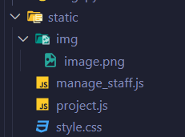

# Static

## Setting up

จะเห็นได้ว่าจากหัวข้อ `layout` มีการใช้ `static` ซึ่ง static คือ folder หนึ่งที่สามารถเข้าถึงได้จากทุกที่ ซึ่งหากต้องการจะใช้ static นั้น เราจำเป็นต้อง setup ก่อน โดย

1. เช็คว่า `INSTALLED_APPS` ใน `settings.py` มี `'django.contrib.staticfiles'` อยู่
2. สร้าง folder ชื่อ `static` ไว้ใน folder project (ที่เดียวกับ manage.py)
3. เพิ่ม code เหล่านี้ใน `settings.py`

```python
STATIC_URL = "static/"

STATICFILES_DIRS = [
    BASE_DIR / "static",
]
```

***

## How to use

เริ่มจากการเพิ่ม `` ไว้ด้านบนของ template file (ข้างล่าง extends หากมี) และเริ่มใช้งานได้เลย โดยใช้คำสั่ง `` เอาไว้ในตำแหน่งที่ต้องการอ้างอิงไฟล์ได้เลย โดย path  ของไฟล์อิงตาม folder static ได้เลย เช่น กำหนดให้ไฟล์ใน folder static เป็นตามนี้

<figure><figcaption></figcaption></figure>

* หากต้องการเข้าถึง `style.css` ต้องเข้าถึงโดยใช้ ``
* หากต้องการเข้าถึง `image.png` ต้องเข้าถึงโดยใช้ ``

<pre class="language-html"><code class="lang-html"><a data-footnote-ref href="#user-content-fn-1"></a>

&#x3C;!DOCTYPE html>
&#x3C;html lang="en">
&#x3C;head>
    &#x3C;meta charset="UTF-8">
    &#x3C;meta name="viewport" content="width=device-width, initial-scale=1.0">
    &#x3C;link rel="stylesheet" href="<a data-footnote-ref href="#user-content-fn-2"></a>">
    &#x3C;title>&#x3C;/title>
&#x3C;/head>
&#x3C;body>
    

    &#x3C;div class="head">
        
    &#x3C;/div>

    
    

    
&#x3C;/body>
&#x3C;/html>
</code></pre>

[^1]: load static ก่อน

[^2]: ใส่ static ไว้ตรงที่ต้องการอ้างอิงไฟล์ได้เลย
